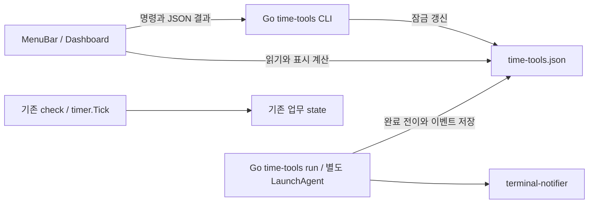

# 시간 도구 확장 — 제품·기술 계약

작성일: 2026-09-28 · 상태: 구현을 위한 제안 결정. 기존 사실은 [분석 문서](time-tools-codebase-analysis.md), 단계는 [로드맵](time-tools-roadmap.md)을 따른다.

## 1. 화면과 사용자 흐름

### 메뉴바

- 기존 햄스터 유지. 제목 숫자는 하나만: 미확인 완료 `완료` → running 일반 타이머 남은 시간 → 기존 작업/휴식 표시. 스톱워치·예약 알람은 메뉴 내부에만 표시한다.
- paused 타이머는 메뉴 내부에 `일시정지 · 08:12`, 제목은 기존 휴식 표시로 돌아간다. 여러 완료는 `완료 N`으로 표시한다.
- 메뉴 구획: 기존 업무 상태/제어 → 집중 모드 → 시간 도구 → 대시보드/설정/About/종료.
- 집중 모드: 현재 classic/pomodoro 체크, `포모도로 시작`, `기본 주기로 전환`, 현재 회차·오늘 완료. 기존 `Start/Stop Work Session`의 의미는 바꾸지 않는다.
- 타이머: 5/10/15/30분, `직접 설정…`(대시보드 타이머 뷰), 실행 중 이름·남은 시간·일시정지·취소. 완료 후 `확인`과 `다시 시작`.
- 메뉴바 종료는 표시 UI만 닫으며 시간 도구 worker는 계속 실행된다. Quit 문구/설명으로 이를 알린다. 전체 백그라운드 중지는 `service stop`이다.

### 대시보드

기존 상위 탭을 늘리지 않고 Timer 탭 안에 `집중 | 타이머` 선택을 추가한다. 후속 단계에서 `스톱워치 | 알람`을 추가한다. 360×600을 유지하되 내용은 ScrollView로 구성하고 포커스된 입력/버튼이 잘리지 않는지 확인한다.

기존 전역 헤더는 **업무·휴식** 상태임을 명시한다. 도구 화면에서 헤더의 pause를 일반 타이머 pause로 오인하지 않게 라벨을 구분한다. Reset/Force Break는 집중 화면에만 배치한다.

타이머 초기 화면: 이름(선택) → 프리셋/직접 시간 → 시작. running 화면: 이름·큰 `MM:SS` 또는 `HH:MM:SS` → 일시정지/취소. 완료 화면: `코드 리뷰 타이머가 끝났어요` → 확인/다시 시작. 완료 화면은 자동으로 사라지지 않는다.

직접 시간은 시·분·초 입력(1초~24시간), 이름은 trim 후 80 Unicode scalar 이하·줄바꿈/제어문자 금지·빈 이름은 `타이머`. 최근 사용 5개(이름+시간, 같은 값 중복 제거)를 로컬 저장한다. 새 실행을 성공적으로 저장한 경우에만 최근 항목에 추가한다.

실행 중 새 타이머를 시작하면 자동 교체하지 않는다. UI가 기존 타이머 취소·교체 확인을 받고 명시적 replace 명령을 보낸다. GUI의 확인은 사용자의 실행 중 데이터 보호 동작이며 개발 진행 승인과 다르다.

### 공통 입력·오류·접근성

- 텍스트 편집 중 Q/R/B 전역 단축키를 처리하지 않는다. window focus를 매 클릭마다 강제로 가져와 입력을 방해하지 않는다.
- CLI 실행 중 해당 버튼을 disable, main thread에서 `waitUntilExit` 금지. stdout/stderr를 함께 비동기 drain하고 timeout/프로세스 실패를 표시한다.
- 명령 실패 시 이전 snapshot 유지 + 오류 + 다시 읽기. 성공을 낙관적으로 확정하지 않는다.
- 숫자뿐 아니라 상태 텍스트 제공. 키보드 탭 순서·Return 시작·VoiceOver 이름/상태 제공. 매초 VoiceOver announcement는 금지하고 상태 전환만 알린다.
- 오래된 CLI/지원하지 않는 JSON 버전은 기능 unavailable로 표시하고 업데이트 안내. 기존 휴식 화면은 계속 사용할 수 있어야 한다.

## 2. 포모도로의 첫 버전 계약

기존 기본값 25분 작업/5분 휴식/4회마다 15분 긴 휴식. UI의 `활동 감지 기준` 설명은 실제 엔진 정책과 일치해야 한다. 책 읽기처럼 입력 장치가 유휴인 시간을 고정 25분으로 측정하려면 일반 타이머를 사용한다.

- 정지 세션에서 시작: `pomodoro on` 성공 → 기존 `start` 성공 → state/config 재읽기.
- 이미 활성인 pomodoro: 시작 버튼 대신 현재 진행 상태 표시, 중복 시작으로 초기화하지 않는다.
- 활성 classic 작업에서 전환: 현재 작업 구간 초기화 안내 후 on → 필요 시 start. 일일 누계는 유지한다.
- 휴식 중 또는 paused 상태: 새 GUI 모드 전환은 비활성, 현재 휴식 종료/재개 후 전환하도록 안내한다. 기존 CLI 호환 동작은 유지한다.
- on 성공/start 실패는 `포모도로 설정은 저장됐지만 작업 시작에 실패했습니다`로 구분한다. 사용자가 재시도할 때 on을 다시 호출해 구간을 재초기화하지 않고 필요한 start만 재시도한다.
- on/off의 state reset 실패를 숨기지 않는다. config만 바뀔 수 있음을 오류에 포함하고 실제 파일을 재읽는다. 이 경우 자동 config rollback으로 다른 동시 변경을 덮어쓰지 않는다.
- 회차: 다음 작업 회차와 완료 수를 구분한다. 예: `집중 2/4 · 오늘 완료 5회`; 긴 휴식에는 `긴 휴식`을 표시한다. 단순 `% 4`가 0회차로 보이지 않도록 순수 presentation 테스트를 작성한다.
- 시간 설정 저장은 다음 주기를 위한 편집으로 구분하고 실행 중 변경은 MVP에서 비활성으로 둔다.

## 3. 일반 타이머·스톱워치·알람 간 독립성

| 사건 | 업무/포모도로 | 일반 타이머 | 스톱워치 | 시각 알람 |
|---|---|---|---|---|
| 업무 stop/pause, 주말 | 기존 정책 | 계속 | 계속 | 유지 |
| 휴식 overlay | 기존 정책 | 계속·완료 가능 | 계속 | 발화 가능 |
| 창/메뉴바 종료 | 기존 agent | worker 계속 | 저장 기준 복원 | worker 계속 |
| 컴퓨터 sleep/종료 | 기존 gap 정책 | 경과시간에 포함 | 경과시간에 포함 | 복귀 시 지난 시각 처리 |
| 일반 타이머 pause | 변화 없음 | 남은 시간 고정 | 변화 없음 | 변화 없음 |
| service stop | check 중지 | 알림 실행 중지, deadline 유지 | 저장된 기준 유지 | 알림 실행 중지 |

`service start` 후 지난 deadline은 아래 복구 정책을 적용한다. 시스템이 자고 있거나 서비스가 정지된 동안 알림을 보장하지 않는다. UI에는 worker 실행 중 여부를 표시한다.

## 4. 프로세스·데이터 구조

이 구조를 선택한 이유: GUI 자체가 시간을 소유하면 창 종료 시 완료 처리가 끊기고 두 UI 간 중복 알림이 생긴다. 기존 `check`를 1초로 줄이면 업무 감지·휴식 화면·설치 계약까지 영향을 준다. 별도 worker는 프로세스 하나를 추가하는 비용이 있지만 독립 타이머와 기존 휴식 기능의 실행 주기를 분리한다. 기존 Go와 launchd를 사용하므로 새 언어·DB·IPC 서버는 도입하지 않는다.

신규 제안 경로:

- `internal/timetools/{model,countdown,store,scheduler,notification}.go`
- `cmd/break-reminder/time_tools.go`
- `helpers/Sources/HelperCore/{TimeToolsSnapshot,TimeToolsPresentation,CLICommandClient}.swift`
- `helpers/Sources/DashboardApp/{TimeToolsViewModel,CountdownView}.swift`
- 후속 `stopwatch.go`, `alarm.go`, 해당 Swift 뷰/테스트.

파일은 `~/.config/break-reminder/time-tools.json`(0600), lock은 같은 경로의 `.lock`이다. runtime heartbeat는 별도 `time-tools-runtime.json`으로 둬 데이터 revision을 오염시키지 않는다. 사용자 이름은 알림에 쓰되 일반 로그에는 기본적으로 기록하지 않는다.

저장 계약:

- Go `Store.Update(expectedRevision, fn)`가 flock → load/validate → mutation → revision 증가 → 같은 디렉터리 임시 파일/flush/close/rename을 처리한다. 실패 시 기존 파일을 유지한다. 기존 `state.Update`를 참고하되 별도 도메인을 구현한다.
- 모든 command와 worker가 이 경로를 사용한다. 네트워크/알림 전송 중 store lock을 잡지 않는다.
- 파일 없음은 빈 초기 상태. 손상·미지원 버전은 오류이며 자동 초기화/덮어쓰기 금지. 기존 파일 보존 및 복구 안내.
- UI는 atomic snapshot 읽기, 알 수 없는 추가 field는 무시, 지원하지 않는 schema version은 쓰기 금지. CLI의 status JSON도 동일 DTO.
- `--if-revision`으로 오래된 UI 조작을 거부한다. target ID도 검사한다. 재읽기 후 사용자가 재시도하며 자동 덮어쓰기 금지.

### 제안 JSON v1

| 필드 | 형태/의미 |
|---|---|
| `schema_version`, `revision` | 1, 단조 증가하는 정수 |
| `countdown` | null 또는 아래 상태 |
| `recent_countdowns` | 최근 성공한 실행 설정 최대 5개 |
| `events` | 완료/전송/확인 이벤트. active/미확인은 보존, 확인된 이벤트 최근 100개만 유지 |
| `stopwatch`, `stopwatch_history` | Phase 3에서 추가; 없는 경우 null/빈 목록 |
| `alarms` | Phase 4에서 추가; 없는 경우 빈 목록 |

CountDown: `id`, `label`, `duration_ms`, `phase`(running/paused/completed/canceled), `deadline_unix_ms`(running만), `remaining_ms`(paused만), `created_at`, `completed_at`(완료만). idle은 countdown=null. 재실행은 새 ID다. JSON의 모든 timestamp는 UTC Unix milliseconds 정수이며 없는 값은 null이다.

Event: `id`(source ID+completion 구분), `source_id`, `kind`, `due_at`, `delivery_state`(pending/claimed/sent/failed/unknown/silent), `attempted_at`, `error_code`, `acknowledged_at`. 상태 완료와 UI 확인은 별개다. 단일 타이머를 교체해도 기존 미확인 완료 이벤트는 사라지지 않는다.

미확인 이벤트가 100개에 도달하면 새 예약/시작을 거부하고 확인을 요청한다. 이미 시작된 항목의 완료 이벤트는 항상 저장한다(따라서 잠시 상한을 넘을 수 있음). 무한 데이터 증가를 막으면서 기존 예약을 버리지 않는다.

## 5. 시간과 상태 전이

일반 타이머는 절대 UTC deadline을 저장하고 `remaining=max(0, deadline-now)`로 표시한다. 시작 때 `deadline_unix_ms = time.Now().UnixMilli() + duration_ms`, worker는 약 1초마다 **새로 읽은** `time.Now().UnixMilli()`와 비교한다. `time.Timer(duration)`/`Sleep(duration)` 한 번으로 완료를 결정하거나 tick 횟수를 누적하지 않는다. ticker는 짧은 재검사 기회일 뿐이고 전달된 tick timestamp 대신 현재 벽시계를 다시 읽는다. worker 시작 직후에도 즉시 reconcile한다. 따라서 sleep 후 첫 실행 기회에 이미 지난 deadline을 처리한다.

Go 문서는 일부 시스템에서 monotonic clock이 sleep 중 멈출 수 있다고 설명한다. 이 계획은 macOS의 모든 Go 버전에서 동일하다고 단정하지 않고, 해당 구현 차이에 의존하지 않는 wall-clock 비교를 택한다. 실제 wake 후 스케줄링 지연은 수동 QA로 확인한다. [Go time — Monotonic Clocks](https://pkg.go.dev/time#hdr-Monotonic_Clocks)

| 현재 상태 | 명령/사건 | 다음 상태 |
|---|---|---|
| 없음/완료/취소 | start | 새 ID의 running |
| running | pause(deadline 전) | 남은 ms를 저장한 paused |
| paused | resume | now+remaining deadline의 running |
| running/paused | cancel | canceled, 완료 이벤트 없음 |
| running | now ≥ deadline | completed + 완료 이벤트 1개 |
| running/paused | start | conflict; 명시적 replace만 기존 취소 후 새 실행 |
| completed | acknowledge | 완료 이벤트 확인, countdown은 완료 유지 |
| completed/canceled | restart | 기존 label/duration으로 새 ID |

경계 원칙: 잠금을 얻은 시각으로 due 상태를 먼저 정규화한 뒤 명령을 적용한다. 정확히 deadline에서 pause/cancel하면 이미 완료된 항목이며 완료 이벤트를 지우지 않는다. replace는 이전 due 이벤트를 보존한 채 새 ID를 만든다. pause/resume/cancel의 같은 ID 중복 요청은 가능한 동일 결과를 반환하고 이벤트를 중복 생성하지 않는다.

첫 버전의 시간 기준은 시스템 벽시계다. sleep·프로세스 재시작·재부팅을 포함한다. 사용자가 시스템 시각을 앞으로 옮기면 빨리 만료하고 뒤로 옮기면 남은 시간이 늘어날 수 있다. 시간대 표시 변경은 UTC deadline을 바꾸지 않는다. 시계 변경에 무관한 monotonic 지속시간 구현은 별도 개선이며 이 버전이 보장한다고 쓰지 않는다.

## 6. worker·서비스·알림

- `break-reminder time-tools run`을 별도 LaunchAgent `com.devlikebear.break-reminder.timetools`로 실행한다. plist는 `~/Library/LaunchAgents/`에 두고 로그인한 사용자의 Aqua 세션에서 `RunAtLoad=true`, `KeepAlive=true`, `LimitLoadToSessionType=Aqua`, `ThrottleInterval=10`으로 유지한다. logout 시 종료하고 다음 GUI login 때 복구한다. 메뉴바 자식 프로세스/시스템 daemon으로 실행하지 않는다. 기존 `check` agent를 대체하지 않는다.
- `service stop`은 job을 unload하여 KeepAlive의 재실행을 막는다. PID만 종료하는 방식은 stop으로 취급하지 않는다. crash는 launchd가 재시도하고 startup reconcile로 deadline을 복구한다. 재시작 throttle 동안은 2초 완료 SLA 대상이 아니며 UI health를 표시한다. plist key 의미는 로컬 `man launchd.plist`와 [Apple launchd 가이드](https://developer.apple.com/library/archive/documentation/MacOSX/Conceptual/BPSystemStartup/Chapters/CreatingLaunchdJobs.html)를 참고한다.
- MVP worker는 1초 주기의 가벼운 reconcile을 사용한다. 변경 없는 tick은 JSON 재쓰기 금지, idle detector/AI/TTS/휴식 화면 호출 금지. 단일 인스턴스 lock으로 직접 run과 agent 중복 실행을 막는다.
- 파일 변경과 due 시간을 확인하며 heartbeat는 최대 5초 간격으로 별도 runtime 파일에 기록한다. health는 15초 이내 heartbeat면 running, 아니면 unavailable로 표시한다. 실제 worker 중단 후 이 감지 지연은 존재한다.
- CLI start/resume/알람 예약은 worker unavailable이면 저장 전에 실패한다. foreground worker는 개발 모드에서 허용한다. UI는 상태를 저장한 후 worker가 죽을 수 있으므로 health 이상을 계속 표시한다. status/cancel/acknowledge는 worker 없이도 가능하다.
- root CLI의 config pre-run이 새 도구를 막지 않도록 각 leaf 명령에 `allowInvalidConfig`를 적용한다. 업무 config가 손상돼도 독립 도구의 조회/취소/worker는 동작해야 한다.
- 서비스 install/start/stop/uninstall/status/restart, 자동 업데이트 후 RestartRuntime, doctor에 새 job을 연결한다. service stop/uninstall은 예약 데이터 자체를 지우지 않는다. 업그레이드 전에 예약 데이터 백업 정책을 README에 적는다.
- desktop notification은 기존 terminal-notifier를 재사용한다. 새 API는 event별 group ID를 받아 휴식 알림과 서로 덮어쓰지 않도록 한다. 기존 `Notifier.Send` 계약은 유지한다.
- 일반 타이머/알람은 독립적으로 소리 1회와 시스템 알림을 요청한다. 기존 업무 `notifications_enabled`/TTS 설정과 독립이며 새 알림을 TTS로 읽지 않는다. OS 알림 설정/집중 모드 때문에 실제 배너가 억제될 수 있음을 설정 화면에서 안내한다.

### 설치와 업그레이드 전환 계약

현재 `CheckAndUpgrade`는 brew 작업만 하고, `cmd/break-reminder/update.go`가 기존 `RestartRuntime`을 호출한다. `RestartRuntime`은 plist를 생성하지 않는다. Formula `post_install`도 명령 안내만 한다. 따라서 최신 바이너리가 설치됐다는 이유만으로 새 worker가 설치됐다고 표시하지 않는다.

| 진입 경로 | 확정 동작 | 실패/중지 처리 |
|---|---|---|
| 신규 설치/명시적 `service install` | timer/menu/worker plist 설치와 로드, 기존 Homebrew updater 정책 유지 | 부분 설치 상태 및 재실행 안내 |
| 이 기능이 없는 구버전 updater에서 첫 업그레이드 | 구버전 프로세스의 코드가 계속 실행되므로 새 hook 실행을 가정하지 않음. 새 UI에서 worker 미설치 안내와 `시간 도구 설정` 버튼 제공 | 사용자가 버튼으로 `service install` 1회 실행하기 전 타이머 start 차단. 기존 휴식 사용은 유지 |
| 사용자가 직접 `brew upgrade` | Formula caveats와 새 UI/doctor에서 동일한 1회 설정 안내 | brew post_install에서 사용자 agent를 몰래 로드하지 않음 |
| 새 updater가 이후 버전으로 업그레이드 | stable bin의 **새 바이너리**에 `service migrate-runtime` 호출 후 runtime restart | migration 실패는 업데이트 설치 성공/서비스 복구 실패를 구분해 보고 |
| 서비스가 중지/미설치된 상태 | 자동 migration은 stopped/uninstalled intent 유지 | 자동 load 금지. 명시적 install/start만 재개 |

`service migrate-runtime`은 구현 예정 내부 명령이다. 기존 관리 대상 runtime 설치만 idempotent하게 reconcile하고 updater job은 reload하지 않는다(현재 updater 자신을 종료하지 않기 위함). 업데이트 직전 설치/loaded 상태를 캡처해 기존 stopped job은 다시 켜지 않는다. 최초 구버전 전환은 명시적 설정 경로를 사용하며 이를 자동 마이그레이션 완료로 표현하지 않는다. migration marker는 plist 생성·필요한 load가 모두 성공한 뒤에만 저장한다. 중간 실패를 재실행해도 예약 JSON은 보존한다.

### 알림 수단 실패와 전체화면 UX

- terminal-notifier가 없거나 실행이 실패해도 타이머 시작 자체는 허용하되, 시작 전에 `시스템 알림을 사용할 수 없음 — 완료는 앱에서 확인`을 표시한다. worker unavailable은 별도 오류이며 시작을 차단한다.
- 항상 지속되는 완료 event, 메뉴바 `완료 N`, 대시보드 완료 카드가 기본 fallback이다. 이 버전에서는 osascript 또는 별도 소리 backend를 추가하지 않는다. terminal-notifier 실패 시 소리도 보장하지 않는다. 닫힌 UI를 임의로 띄우거나 중복 경고음을 재생하지 않는다.
- `doctor`는 현재도 알림 Send 오류를 fail로 보고한다. 여기에 설치된 경로/누락·실행 실패/worker 미설치·unloaded·heartbeat stale를 구분하고 복구 명령 및 시각 fallback을 안내한다. 전송 성공을 실제 배너 가시성 PASS로 취급하지 않는다.
- 휴식 overlay가 배너/메뉴바를 가릴 수 있으므로 `BreakScreenApp` primary 화면에 **읽기 전용 완료 안내 줄**을 추가한다. `타이머 완료: 코드 리뷰 · 자세한 내용은 휴식 후 확인`처럼 보여주고 업무 휴식/가이드 카운트다운을 중단하거나 창을 자동 닫지 않는다. 새 JSON을 1초 기존 UI tick에서 읽되 write/ack/알림 전송은 하지 않는다. secondary 화면은 기존 정책을 유지한다.
- overlay에 보였다는 이유로 완료를 확인 처리하지 않는다. 휴식 종료 후 메뉴바/대시보드에서 확인할 때까지 유지한다. 읽기 실패는 휴식 기능을 중단하지 않고 마지막 정상 완료 안내를 유지하며 성공으로 추정하지 않는다.

### 완료 전달의 보장 수준

로컬 완료 전이는 정확히 한 번 기록한다. OS 알림의 exactly-once 전달은 보장하지 않는다.

1. reconcile에서 completed와 pending event를 함께 저장한다.
2. worker가 event를 claimed로 저장하고 lock을 해제한 뒤 알림을 전송한다.
3. 결과를 sent/failed로 저장한다. send 전에 실패한 프로세스 또는 send 후 저장 실패는 재시작 시 unknown으로 표시하고 자동 재전송하지 않는다. 중복 소리를 피하는 **자동 시도 최대 1회** 정책이다.
4. failed/unknown도 UI 완료는 유지한다. 사용자가 누르는 `알림 다시 보내기`만 새 시도를 만들며 pending/claimed 중에는 비활성화한다. 이 기능은 알림 문제 회복용이며 타이머를 다시 시작하지 않는다.
5. 조회/확인 명령이 먼저 due 전이를 만들더라도 worker가 pending을 찾아 처리한다. acknowledge가 먼저 저장되면 아직 미전송인 pending은 silent로 바꿔 뒤늦은 알림을 막는다.

복귀 시 deadline이 지난 지 **5분 이내**면 일반 완료 알림 요청, **5분 초과**면 silent 완료 기록과 `자리를 비운 동안 완료` 표시. 중지·재부팅·sleep 모두 같은 정책이다. claimed 복구에는 unknown 정책이 우선한다. 완료 기록은 대시보드를 닫아도 남는다.

알림 프로세스에는 5초 timeout을 적용하고 scheduler와 분리된 단일 전송 큐를 둔다. 알림 명령이 멈춰도 다음 타이머/알람 완료 상태 저장을 막지 않는다. 잠금 밖 전송 직전 acknowledged/canceled 여부를 다시 검사하되 이미 OS에 넘긴 알림을 취소했다고 보장하지 않는다.

## 7. 후속 도구 계약

### 스톱워치

동시 1개, `idle/running/paused`. `accumulated_ms`, `started_at_unix_ms`로 계산하며 paused 동안은 증가하지 않는다. 초 단위 표시, 랩 제외. sleep/서비스 종료 시간도 포함하는 경과시간 측정이다.

`완료 및 저장`은 현재 구간을 닫고 UUID·label·시작/종료·duration을 history에 추가한 뒤 idle. reset은 저장 없이 초기화하며 실행 중/기록 전에는 UI 확인. history 최대 500개, 오래된 항목부터 정리하고 제한을 화면에 설명. 오늘/최근 목록과 단건 삭제만 제공한다. 날짜는 저장 당시 local date와 time zone을 기록해 여행 후 날짜 재분류를 피한다.

업무 통계·AI summary·기존 history 파일에는 쓰지 않는다. 저장 요청 재시도는 같은 세션 ID로 중복 기록하지 않는다.

### 시각 알람

최대 10개 예약, 1회성. `id/label/fire_at_unix_ms/time_zone/created_local_datetime/phase(scheduled/fired/canceled)` 저장. 날짜와 시각을 명시하며 기본값은 현재보다 5분 뒤. 과거 입력을 임의로 내일로 바꾸지 않고 오류로 반환한다.

생성 때 선택한 시각을 하나의 절대 시각으로 확정한다. 여행/시스템 시간대 변경 시 실행 instant는 유지하고 화면에 현재 시간대와 원래 예약 시간대를 함께 표시한다. DST에서 없는 시각은 거부, 두 번 존재하는 시각은 앞/뒤 occurrence를 사용자가 선택해야 한다. 반복 알람은 없다.

edit은 아직 scheduled인 항목만 가능하고 due를 먼저 정규화한다. 같은 시각 여러 알람은 각각 event를 만들며 시스템 소음 방지를 위해 같은 reconcile batch의 알림을 한 요약으로 묶는다. batch의 항목 ID와 전송 결과를 함께 보존한다. 지난 알람은 타이머와 같은 5분 정책을 따른다.

## 8. 호환성·롤백

- 기존 `~/.break-reminder-state` 형식과 CLI start/stop/pause/resume 의미를 바꾸지 않는다.
- Phase 2부터 stopwatch/history/alarms 키를 예약하고 아직 해석하지 않는 값과 unknown field를 raw JSON으로 보존한다. Phase 3/4에서 같은 v1의 예약 필드를 구현할 때 없는 값에만 기본값을 채우며 다른 도구 데이터는 유지한다. 의미나 필드 형식을 바꾸는 변경은 schema_version을 올리고 migration을 제공한다. 미래 schema를 구버전이 덮어쓰지 못하도록 version 검사를 우선한다.
- Phase 1 rollback은 UI/명령 오류 처리 변경을 되돌린다. Phase 2 이후 rollback은 새 worker job을 먼저 unload하고 이전 바이너리로 돌아간다. JSON 파일은 백업·보존한다. 구버전은 예약 알림을 처리하지 않으므로 UI에서 rollback 전 이를 알린다.
- 전체 앱 변경 없이 Swift 직접 writer를 모두 교체하는 리팩터링은 별도 작업이다. 단, 새 기능이 기존 state 쓰기를 추가하는 것은 금지한다.
