# Start One Guided Break — 구현 설계

- 문서 상태: 구현 handoff
- 기준 문서: `utility-mvp-prd.md`, `utility-mvp-acceptance.md`
- 대상: macOS 14+ `BreakScreenApp`의 block-mode primary window
- 설계 원칙: 새 표면이나 장식보다 `시작 → 120초 진행 → 명시적 완료`의 마찰을 줄인다.
- 범위 보호: MenuBarApp, DashboardApp(360×600), notify mode, TUI, Go state/config/CLI는 변경하지 않는다.

## 1. 설계 방향과 선택 근거

### 채택: 기존 휴식 화면 안의 단일 가이드 카드

기존 전체 휴식 타이머를 상위 정보로 유지하고, 기존 무작위 활동 문구 자리만 고정 가이드 카드로 확장한다. `시작` 전에는 활동과 소요 시간을, 진행 중에는 가이드 남은 시간과 한 단계 문구를, 완료 시에는 결과를 같은 위치에서 교체한다.

선택 근거:

1. 사용자는 이미 block overlay에 있으므로 다른 앱·터미널·화면을 열지 않는다.
2. 전체 휴식 남은 시간과 가이드 남은 시간을 서로 다른 제목과 크기로 표시해 시간의 소유권을 구분한다.
3. 한 상태에 한 개의 가이드 주 동작만 둬 시작과 취소의 의미를 명확히 한다.
4. 기존 AppKit 수동 frame, 시스템 폰트, dark overlay, 파란 break accent, rounded button 패턴을 재사용한다.
5. 활동 선택, 개인화, 기록, 새 설정을 만들지 않아 승인된 단일 MVP 범위를 지킨다.

### 기각한 방향

- 별도 modal/sheet: 전체화면 overlay 위에 또 다른 계층과 닫기 의미를 추가한다.
- Dashboard/MenuBar 진입점: PRD 비범위이고 표면 간 상태 동기화가 필요하다.
- mascot 중심 완료 연출: 새 에셋·애니메이션이 필요하고 Reduce Motion 및 3초 낭독과 충돌한다.

## 2. 정보 구조

Primary window의 위계는 항상 다음 순서다.

1. 휴식 맥락: `휴식 시간이에요`
2. 전체 휴식 남은 시간: `MM:SS` + 전체 진행 막대
3. 가이드 카드: phase별 제목, 보조 시간/문구, 주 동작
4. 선택적 오늘 통계: 기존 CLI 통계가 0이 아닐 때만 표시
5. 기존 Skip: 기존 `skipAfter` 정책 그대로
6. 상시 Esc 안내

전체 휴식 타이머는 화면에서 가장 큰 숫자다. running의 2분 타이머는 카드 안의 두 번째 계층이다. 따라서 사용자가 가이드 완료와 전체 휴식 완료를 혼동하지 않는다.

## 3. 사용자 흐름

```mermaid
flowchart TD
    A[Go가 break state 저장] --> B[block helper 실행]
    B --> C{primary / secondary}
    C -->|primary| R[Ready: 고정 활동 카드]
    C -->|secondary| S[기존 비상호작용 Break Time]
    R -->|시작, 전체 휴식 ≥ 123초| G[Running 120초]
    R -->|시작하지 않음| R
    R -->|가이드 취소| R
    G -->|120번째 guided tick| D[Completed 3초]
    D -->|3번째 display tick| X[overlay dismiss]
    R -->|Esc 또는 활성 Skip| X
    G -->|Esc 또는 활성 Skip| X
    D -->|Esc 또는 활성 Skip| X
    R -->|전체 휴식 0| X
    G -->|전체 휴식 0, 우선 처리| X
    B -->|helper 없음| F[기존 notification fallback]
    B -->|helper 비정상 종료| W[warning 후 helper 반환, 다음 launchd interval에서 복구]
```



### 상태 전이 규칙

`showOverlay`의 `cmd.Run()`은 helper 종료까지 현재 Go check를 block한다. macOS `StartInterval`은 실행 중인 동일 job의 firing을 missed하므로 overlay 중 동시 Go check를 전제로 하지 않는다. break state는 helper 시작 전에 저장되고, helper 종료 뒤 다음 interval에서 새 check가 재개된다. 이 실제 LaunchAgent 재개 시점은 수동 QA 전까지 `NOT RUN`이다.

| 현재 상태 | 입력/조건 | 다음 상태 | UI 결과 | side effect |
|---|---|---|---|---|
| launch | primary window 생성 | ready | 카드와 Start 표시 | 없음 |
| ready | 1초 tick | ready | 전체 휴식만 감소 | 없음 |
| ready | Start, `remaining >= 123` | running(120) | 카드 내용과 control 교체 | 메모리 상태만 변경 |
| ready | Start, `remaining < 123` | ready | Start disabled; 짧은 휴식 설명 | 없음 |
| running(N) | guided tick, N > 1 | running(N-1) | 가이드 시간/단계 갱신 | 없음 |
| running(1) | guided tick | completed(3) | 완료 텍스트; announcement 1회 | 메모리 상태만 변경 |
| running | Cancel | ready | 카드 초기화; 조건에 따라 Start 활성/비활성 | 없음 |
| completed(3/2) | tick | completed(2/1) | 완료 화면 유지 | 없음 |
| completed(1) | tick | dismiss | 모든 window 닫고 terminate | 없음 |
| any | Esc | dismiss | 즉시 종료 | 없음 |
| any | enabled Skip | dismiss | 즉시 종료 | 없음 |
| any | 전체 휴식 remaining <= 0 | dismiss | guided 결과보다 우선 종료 | 없음 |
| process 재실행 | helper launch | ready | 이전 guided phase 복원 안 함 | 없음 |

## 4. 공통 시각 규칙

새 디자인 시스템을 만들지 않는다. 아래 값은 현재 `BreakScreenApp` 및 `ThemeManager` 의미를 구현 가능한 AppKit 값으로 정리한 것이다.

### 색

| 용도 | 값 | 기존 근거 |
|---|---|---|
| overlay background | `NSColor(white: 0.08, alpha: 0.95)` | `BreakScreenApp` 현행 |
| primary text | `.white` | 현행 title/active control |
| secondary text | `NSColor(white: 0.70, alpha: 1)` | 현행 activity text |
| tertiary text | `NSColor(white: 0.50, alpha: 1)` | 현행 stats/disabled control |
| quiet hint | `NSColor(white: 0.35, alpha: 1)` | 현행 Esc hint |
| break accent | `NSColor(red: 0.40, green: 0.702, blue: 1.0, alpha: 1)` | `ThemeManager.accentBreak` dark 의미 |
| progress track | `NSColor(white: 0.30, alpha: 1)` | 현행 progress track |
| card surface | `NSColor(white: 0.145, alpha: 0.96)` | `ThemeManager.surface` dark 의미 |
| disabled fill | `NSColor(white: 0.22, alpha: 1)` | 기존 Dashboard button 계열 |

색은 상태의 유일한 신호가 아니다. ready/running/completed 모두 서로 다른 제목·시간·문구를 표시한다. 텍스트 대비는 흰색/70% 회색을 8% 배경 또는 14.5% card 위에 사용한다. 35% Esc hint는 보조 안내이므로 핵심 조작이나 상태 전달에 사용하지 않는다.

### 타이포그래피

모두 San Francisco 시스템 폰트이며 외부 폰트를 추가하지 않는다.

| 요소 | AppKit 지정 | 줄 수 |
|---|---|---:|
| 화면 제목 | `systemFont(48, .bold)` | 1 |
| 전체 휴식 시간 | `monospacedDigitSystemFont(96, .ultraLight)` | 1 |
| 카드 eyebrow | `systemFont(13, .semibold)` | 1 |
| 카드 제목 | `systemFont(22, .semibold)` | 최대 2 |
| guided 남은 시간 | `monospacedDigitSystemFont(48, .light)` | 1 |
| 단계/상태 문구 | `systemFont(18, .regular)` | 최대 2 |
| 통계 | `systemFont(16, .medium)` | 1 |
| 버튼 | `systemFont(16, .medium)` | 1 |
| Esc 안내 | `systemFont(14, .light)` | 1 |

### 간격과 형태

- 기준 간격: 8pt; 사용 값: 8, 12, 16, 24, 32.
- primary content 최대 폭: 600pt; 화면 폭이 작으면 `screenWidth - 48pt`.
- 전체 진행 막대: 최대 400×8pt, radius 4pt.
- 가이드 카드: 최대 600×196pt, radius 16pt, 내부 여백 24pt.
- 모든 클릭 control의 hit area: 최소 120×44pt. 기존 Skip도 44pt 높이로 맞춘다.
- primary button: `.rounded`, key equivalent Return (`"\r"`), width 120pt, height 44pt.
- secondary Cancel/Skip: `.rounded`, width 최소 120pt, height 44pt.
- 그림자, blur, gradient, 새 icon, emoji를 추가하지 않는다.

### 반응형 규칙

`BreakScreenApp`은 full-screen이므로 360×600 Dashboard 제약을 적용해 Dashboard를 변경하지 않는다. BreakScreen primary의 최소 검수 viewport는 800×600이다.

- 폭 800pt 이상: card 600pt, progress 400pt.
- 폭 800pt 미만: 좌우 margin 24pt, card `frame.width - 48pt`, progress `min(400, cardWidth)`.
- 높이 700pt 미만: 화면 제목 40pt, 전체 타이머 80pt, 세로 간격을 8pt 단위로 한 단계 축소하되 control 높이는 44pt 유지한다.
- 카드 제목/단계는 중앙 정렬, word wrap, 최대 2줄. 잘림 대신 카드 내부의 세로 공간을 사용한다.
- secondary display는 현행 `☕ Break Time` 한 줄과 비상호작용 정책을 그대로 둔다.

## 5. 화면별 와이어프레임과 명세

아래 wireframe은 primary display의 중앙 600pt 열을 나타낸다.

### 5.1 Ready — 시작 가능

```text
                    휴식 시간이에요

                         09:42              ← 전체 휴식
                  ━━━━━━━━━━━━━━━━

        ┌────────────────────────────────────┐
        │  2분 가이드                         │
        │  서서 목과 어깨를 풀어보세요          │
        │  같은 화면에서 천천히 따라 해요.       │
        │                                    │
        │              [ 시작 ]              │
        └────────────────────────────────────┘

                  오늘: 작업 2h · 휴식 10m

              [ 1분 48초 후 건너뛰기 ]
                 Esc를 누르면 언제든 닫혀요
```

- 카드 제목의 정확한 제품 카피는 `2분 동안 서서 목과 어깨를 풀어보세요`다. 위 wireframe은 줄바꿈 예시다.
- Start는 첫 responder이자 default action이다.
- 전체 휴식이 123초 이상일 때 enabled.
- Skip은 `elapsed < args.skipAfter` 동안 disabled이며 focus 대상에서 제외한다.
- 사용자가 아무것도 하지 않으면 ready를 유지한다. 로딩, 자동 시작, timeout toast가 없다.

### 5.2 Ready — 시작 불가(짧은 잔여 시간)

```text
        ┌────────────────────────────────────┐
        │  2분 가이드                         │
        │  서서 목과 어깨를 풀어보세요          │
        │  이번 휴식에는 2분이 남지 않았어요.    │
        │                                    │
        │             [ 시작 ] disabled      │
        └────────────────────────────────────┘
```

- `remaining < 123`이 되는 tick에서 즉시 갱신한다.
- 안내는 disabled reason을 텍스트로 제공한다.
- disabled Start는 focus 대상에서 제외한다.
- Skip이 enabled라면 첫 focus는 Skip이다. 둘 다 disabled라면 key window 자체에 focus가 남고 Esc만 동작한다.

### 5.3 Running

```text
                    휴식 시간이에요

                         08:37              ← 전체 휴식
                  ━━━━━━━━━━━━━━━━

        ┌────────────────────────────────────┐
        │  목과 어깨 스트레칭                  │
        │                01:15               │  ← 가이드
        │  고개를 천천히 좌우로 기울이고,       │
        │  통증이 있으면 멈추세요.              │
        │                                    │
        │           [ 가이드 취소 ]            │
        └────────────────────────────────────┘

                       [ Skip Break ]
                 Esc를 누르면 언제든 닫혀요
```

- 전체 휴식 `MM:SS`와 guided `MM:SS`를 모두 표시한다.
- guided 남은 시간은 `GuidedBreakPhase.running(remainingSeconds:)`만 소비한다.
- 단계 문구 경계:
  - 120–81: `편안히 서서 어깨의 힘을 빼세요.`
  - 80–41: `고개를 천천히 좌우로 기울이고, 통증이 있으면 멈추세요.`
  - 40–1: `어깨를 뒤로 천천히 돌리며 호흡하세요.`
- Cancel은 overlay를 닫지 않고 ready로 돌아간다.
- running 진입 애니메이션이나 progress animation을 추가하지 않는다. 텍스트를 한 tick에 원자적으로 교체한다.

### 5.4 Completed

```text
                    휴식 시간이에요

                         06:34
                  ━━━━━━━━━━━━━━━━

        ┌────────────────────────────────────┐
        │  완료했어요                         │
        │                                    │
        │  편안하게 남은 휴식을 이어가세요.     │
        │  3초 후 이 화면을 닫아요.             │
        └────────────────────────────────────┘

                       [ Skip Break ]
                 Esc를 누르면 언제든 닫혀요
```

- 화면 카피 계약: `완료했어요 — 편안하게 남은 휴식을 이어가세요.`
- UI에서는 가독성을 위해 em dash 위치에서 두 줄로 배치할 수 있으나 accessibility value는 한 문장 그대로다.
- completed에는 guided control을 두지 않는다. Esc와 기존 enabled Skip은 유지한다.
- 진입 순간 announcement를 한 번만 요청한다. 3초 countdown 숫자는 표시하지 않아 낭독 경쟁을 피한다.
- 세 번째 completed tick에서 overlay를 닫는다. 전체 휴식 state를 완료/작업으로 바꾸지 않는다.

### 5.5 Empty, loading, failure, restart

| 상태 | 표현 | 동작 |
|---|---|---|
| 오늘 통계가 모두 0 | 통계 한 줄만 숨기고 위/아래 요소 간격을 16pt 당김 | placeholder, `0m · 0m`, skeleton 없음 |
| 초기 launch | 동기식 ready 화면 즉시 구성 | spinner/loading 카피 없음 |
| 잘못된/누락 CLI 숫자 | 기존 parser 기본값으로 ready 렌더 | 새 inline error 없음 |
| helper 없음 | Swift UI가 열리지 않음 | Go의 기존 notification fallback |
| helper non-zero | 별도 오류 화면 없음 | warning 후 현재 check가 반환하고, 이미 저장된 break state를 다음 launchd interval의 check가 복구 |
| helper 재실행 | fresh `GuidedBreakSession()` | 항상 ready; 자동 시작/완료 추정 없음 |
| 전체 휴식 0 | 화면 즉시 종료 | guided 완료 카피/announcement 없음 |

## 6. 마이크로카피 표

제품 UI의 새 카피는 한국어로 통일한다. 기존 `Skip Break`와 secondary `Break Time`은 회귀 위험을 줄이기 위해 이번 MVP에서 그대로 유지한다.

| 키/상태 | 화면 카피 | 접근성 카피 |
|---|---|---|
| screen.title | `휴식 시간이에요` | label 동일 |
| overall.time | `MM:SS` | label `전체 휴식 남은 시간`, value `N분 N초` |
| ready.eyebrow | `2분 가이드` | heading으로 결합 가능 |
| ready.title | `2분 동안 서서 목과 어깨를 풀어보세요` | label 동일 |
| ready.support | `같은 화면에서 천천히 따라 해요.` | description 동일 |
| ready.start | `시작` | label `2분 목과 어깨 스트레칭 시작`; hint `같은 화면에서 2분 가이드를 시작합니다.` |
| ready.short | `이번 휴식에는 2분이 남지 않았어요.` | disabled reason으로 읽힘 |
| running.title | `목과 어깨 스트레칭` | label 동일 |
| running.time | `MM:SS` | value `남은 시간 N분 N초, <현재 단계>` |
| running.cancel | `가이드 취소` | label `가이드 취소`; hint `가이드를 멈추고 휴식 화면으로 돌아갑니다.` |
| completed.title | `완료했어요` | label 동일 |
| completed.body | `완료했어요 — 편안하게 남은 휴식을 이어가세요.` | value 동일 |
| completed.announcement | 화면에 중복 표시하지 않음 | `2분 스트레칭을 완료했습니다.` |
| completed.autoDismiss | `3초 후 이 화면을 닫아요.` | description 동일 |
| skip.disabled | `Skip (available in Nmin)` 현행 유지 | disabled이며 focus 제외 |
| skip.enabled | `Skip Break` 현행 유지 | label `휴식 건너뛰기`; hint `현재 휴식 화면을 닫습니다.` |
| escape | `Esc를 누르면 언제든 닫혀요` | static text; key command로도 동작 |

금지 카피: 치료, 자세 교정, 통증 완화 보장, 생산성 향상, 개인 맞춤, 완료 기록을 암시하는 표현.

## 7. 상호작용과 focus

### 포인터/키보드

- Ready enabled: launch 후 Start에 first responder. Return과 Space로 시작한다.
- Ready disabled: Start는 key loop에서 제외. enabled Skip이 있으면 Skip으로 focus 이동.
- Running: Cancel이 first responder. 다음 Tab은 enabled Skip.
- Completed: guided control 없음. enabled Skip만 focus 가능.
- Skip disabled: `refusesFirstResponder = true`, key view loop에서 제외.
- Esc: local key monitor의 keyCode 53 현행 동작을 모든 phase에서 유지한다.
- Shift-Tab은 위 순서의 역방향이다. focus가 secondary display로 이동하지 않는다.
- Start/Cancel을 연속 클릭해도 session 메서드 계약이 phase 밖 입력을 거부/no-op 처리한다. 새 loading lock은 없다.

### VoiceOver

| 요소 | role/label/value/hint |
|---|---|
| 화면 제목 | static text, `휴식 시간이에요` |
| 전체 휴식 시간 | static text 또는 timer group; label `전체 휴식 남은 시간`; value `N분 N초` |
| 전체 progress | indicator; label `전체 휴식 진행률`; value `N퍼센트` |
| Start | button; PRD 지정 label/hint |
| Running group | group; label `목과 어깨 스트레칭`; value `남은 시간 N분 N초, <현재 단계>` |
| Cancel | button; PRD 지정 label/hint |
| Completed group | group; value 완료 문장 |
| Skip | button; enabled일 때만 key loop; disabled 상태와 남은 대기 시간은 화면 텍스트로 인지 가능 |

초 단위 변화마다 전체 화면을 announcement하지 않는다. running group의 value는 조회 시 최신 값이지만 live announcement는 하지 않는다. completed phase 진입 때만 `NSAccessibility.post(element: primaryWindow.contentView, notification: .announcementRequested, userInfo: [.announcement: ..., .priority: NSAccessibilityPriorityLevel.high.rawValue])` 형태로 1회 요청한다. 정확한 AppKit 상수는 컴파일 시 현행 SDK 시그니처에 맞춰 사용한다.

### Reduce Motion와 대비

- 새 transition, pulse, confetti, mascot animation을 추가하지 않는다.
- `NSWorkspace.shared.accessibilityDisplayShouldReduceMotion` 값과 무관하게 정보와 timing은 같다.
- progress fill만으로 phase를 표시하지 않는다.
- focus ring은 AppKit 기본값을 숨기거나 custom draw하지 않는다.
- 고대비/Increase Contrast에서 시스템 button bezel과 focus ring을 유지한다.

## 8. 컴포넌트 상태표

| 컴포넌트 | Ready enabled | Ready short | Running | Completed |
|---|---|---|---|---|
| overall countdown | visible/update | visible/update | visible/update | visible/update |
| overall progress | visible/update | visible/update | visible/update | visible/update |
| guide card title | fixed activity | fixed activity | `목과 어깨 스트레칭` | `완료했어요` |
| guide timer | hidden | hidden | visible/update | hidden |
| instruction | support | short reason | boundary instruction | completion body + auto-dismiss |
| primary guide button | Start enabled/default | Start disabled | Cancel enabled | absent |
| Skip | existing timing | existing timing | existing timing | existing timing |
| stats | input-dependent | input-dependent | input-dependent | input-dependent |
| Esc hint | visible | visible | visible | visible |

## 9. 구현 매핑

### 파일 계약

| 파일 | 변경 | 계약 |
|---|---|---|
| `helpers/Sources/HelperCore/GuidedBreakSession.swift` | 신규 | PRD의 `GuidedBreakPhase`, `GuidedBreakTickResult`, `GuidedBreakSession` 이름/프로퍼티/함수 그대로 |
| `helpers/Tests/HelperCoreTests/GuidedBreakSessionTests.swift` | 신규 | 122/123 guard, 60/120/123 tick, instruction boundaries, cancel/restart, fresh session |
| `helpers/Sources/BreakScreenApp/main.swift` | 제한 수정 | 무작위 activity 영역을 phase card로 교체; 기존 전체 timer/progress/stats/Skip/Esc/multi-display 유지 |
| Go source/config/state | 변경 없음 | `Show`, `showOverlay`, CLI flag, state schema 모두 현행 유지 |

Dashboard의 `ThemeManager`는 `DashboardApp` executable target 내부 타입이어서 `BreakScreenApp`에서 import할 수 없다. 이를 옮기거나 공용 디자인 시스템으로 만들지 않는다. 대신 이 문서의 색 표에 적힌 기존 의미값을 AppKit `NSColor`로 사용한다.

### 신규 Swift 타입/프로퍼티/함수

Planner가 정한 아래 이름은 변경하지 않는다.

```text
GuidedBreakPhase: Equatable
  ready
  running(remainingSeconds: Int)
  completed(remainingDisplaySeconds: Int)

GuidedBreakTickResult: Equatable
  stay
  phaseChanged
  dismiss

GuidedBreakSession
  static activityID
  static activityDurationSeconds
  static completionDisplaySeconds
  private(set) phase
  start(availableBreakSeconds:) -> Bool
  cancel()
  tick() -> GuidedBreakTickResult
  instructionText() -> String
```

`BreakScreenApp`에 필요한 UI 연결 프로퍼티/함수 후보:

| 이름 | 타입/시그니처 | 책임 |
|---|---|---|
| `guidedSession` | `GuidedBreakSession` | process-local phase 소유 |
| `guideCardView` | `NSView!` | 기존 activity 영역의 card surface |
| `guideTitleLabel` | `NSTextField!` | phase title |
| `guideCountdownLabel` | `NSTextField!` | running time; 그 외 hidden |
| `guideInstructionLabel` | `NSTextField!` | support/instruction/completion/short reason |
| `guideActionButton` | `NSButton!` | Start 또는 Cancel; completed에서 hidden |
| `renderGuidedSession()` | `func` | phase와 `remaining`을 읽어 card/control/accessibility를 원자적으로 갱신 |
| `startGuidedBreak()` | `@objc func` | `guidedSession.start(availableBreakSeconds: remaining)` 후 render |
| `cancelGuidedBreak()` | `@objc func` | cancel 후 render, 조건별 focus 복구 |
| `announceCompletion()` | `func` | completed 진입 시 announcement 1회 |
| `updateKeyViewLoop()` | `func` | phase/disabled 상태에 맞춘 focus 순서 |

함수명 후보는 구현자가 시각·상호작용 결정을 다시 하지 않도록 제시한 UI adapter 이름이다. 모델 계약 이름만 API 기준선이며, 동일 역할의 기존 코드 스타일상 더 적합한 private 이름이 있으면 중복 함수를 만들지 말고 하나만 사용한다.

### Tick 순서

`BreakScreenApp.tick()`은 다음 순서를 지킨다.

1. `elapsed += 1`
2. `remaining -= 1`
3. `remaining <= 0`이면 즉시 `quit()`하고 return
4. 전체 countdown/progress/Skip 상태 갱신
5. `guidedSession.tick()` 호출
6. `.phaseChanged`이면 phase가 completed인지 확인해 announcement를 한 번 요청
7. `.dismiss`이면 `quit()`
8. 그 외 `renderGuidedSession()`

ready에서도 `guidedSession.tick()`은 `.stay`여야 하며 자동 시작하지 않는다. Cancel 직후 별도 timer를 만들지 않는다. 하나의 기존 1초 timer만 양쪽 countdown을 구동한다.

### UI가 소비하는 기존 입력

| UI | 입력 소유자 | 소비 값 |
|---|---|---|
| 전체 countdown/progress | `BreakScreenArgs` + local tick | `args.duration`, `remaining`, `elapsed` |
| Start enabled | local overall remaining | `remaining >= 123` |
| Skip enabled/title | 기존 local tick | `elapsed`, `args.skipAfter` |
| 오늘 통계 | 기존 CLI | `args.todayWorkMin`, `args.todayBreakMin` |
| guide phase/time/text | HelperCore pure model | `guidedSession.phase`, `instructionText()` |
| 재실행 | process lifecycle | fresh session; persisted input 없음 |
| helper fallback | Go `internal/breakscreen` | 기존 `FindHelper`, `sendNotification`, command exit |

Swift는 state/config/history/log/network를 읽거나 쓰지 않는다. root PNG와 기존 hamster/vector asset은 이 화면에 사용하지 않고 수정·변형·이동·삭제·스테이징하지 않는다.

## 10. P0 AC 역추적과 UI 관측점

| AC | 화면/상태 | UI 관측점 | 자동/수동 검증 |
|---|---|---|---|
| AC-01 | Ready | 고정 card 1개, enabled default Start, 기존 overall/progress/stats/Skip/Esc, secondary 불변 | initial/tick unit + 600/120 UI |
| AC-02 | Running→Completed | running(60)에 `01:00`+중간 문구; tick 120 완료; announcement 1회; 3초 후 dismiss | 123 virtual ticks + 130초 실런타임 |
| AC-03 | Ready/Running/any | 무시 no-auto-start; Cancel ready; Esc/Skip dismiss; disabled Skip focus 제외 | cancel/restart unit + 180/5 UI |
| AC-04 | Ready short/restart | 122 disabled+reason, 123 enabled; restart ready; parent remaining 0 우선 | boundary/fresh unit + UI |
| AC-05 | launch failure | Swift error surface 없음; fallback/default 현행 | Go fallback + ArgsParser tests |
| AC-06 | all | label/value/hint, focus 순서, text-based phase, no required motion | VoiceOver/keyboard/Reduce Motion manual |
| AC-07 | Running 60 | Swift running(60); overall remains Go-owned; source/assets contract unchanged | Swift/Go unit + diff inspection |
| AC-08 | repository | visual implementation compiles; regressions 없음 | test/vet/build/diff gates |

## 11. 수동 QA 시나리오

결과는 Programmer가 `docs/product/utility-mvp-implementation.md`에 환경, 실제 관찰, pass/fail과 함께 기록한다.

### QA-01 Ready와 짧은 휴식

1. `make build`.
2. `bin/break-screen --duration 600 --skip-after 120 --work-min 60 --break-min 10` 실행.
3. 고정 카드 한 개, 전체 timer/progress/stats, Start, disabled Skip, Esc를 확인.
4. 2초 기다려 Start가 자동 실행되지 않는지 확인.
5. 종료 후 `bin/break-screen --duration 122 --skip-after 120` 실행.
6. Start disabled와 `이번 휴식에는 2분이 남지 않았어요.`를 확인.
7. 기대: AC-01/AC-04 pass.

### QA-02 123초 실제 진행

1. `bin/break-screen --duration 130 --skip-after 120` 실행 후 5초 안에 Start.
2. stopwatch로 시작 직후 guided `02:00` 확인.
3. 60초에 `01:00`, 중간 단계 문구 확인.
4. 120초에 완료 제목/본문 확인.
5. 3초 뒤 overlay 종료 확인.
6. 새 app/terminal/network가 열리지 않았는지 확인.
7. 기대: AC-02 pass. 허용 오차는 UI timer scheduling 관찰상 ±1초이나 model tick 수는 정확히 123이어야 한다.

### QA-03 Cancel, restart, Esc, Skip

1. `bin/break-screen --duration 180 --skip-after 5` 실행.
2. Start→10초 대기→Cancel; ready로 돌아가고 overall timer가 계속 감소하는지 확인.
3. remaining이 123 이상이면 다시 Start 가능한지 확인.
4. 재실행하여 Esc로 즉시 종료 확인.
5. 다시 실행해 5초 전 Skip disabled/focus 제외, 5초 후 enabled/focus 가능, 실행 시 종료 확인.
6. 기대: AC-03 pass.

### QA-04 Keyboard와 VoiceOver

1. VoiceOver를 켜고 `bin/break-screen --duration 180 --skip-after 5` 실행.
2. 첫 focus가 Start이며 label/hint가 정확한지 확인.
3. Return으로 시작하고 running group의 이름, 남은 시간, 단계가 읽히는지 확인.
4. Tab 순서가 Cancel→enabled Skip인지 확인. disabled Skip은 건너뛴다.
5. Cancel의 label/hint를 확인하고 Space로 실행.
6. 다시 시작해 완료 시 announcement가 정확히 한 번인지 확인.
7. 기대: AC-06 pass.

### QA-05 Reduce Motion, 대비, 다중 display

1. Reduce Motion off/on 각각 QA-03의 start/cancel을 수행.
2. 기능과 정보가 같고 새 필수 animation이 없는지 확인.
3. Increase Contrast에서도 button 경계와 focus ring이 보이는지 확인.
4. 다중 display가 있으면 primary만 pointer/keyboard를 받고 secondary는 기존 `Break Time`만 보이는지 확인.
5. 기대: AC-01/AC-06 pass.

### QA-06 오류/재시작/launchd 60초 계약

1. 기존 AC 문서의 helper-not-found와 non-zero fixture test를 실행.
2. invalid/missing args parser tests를 실행.
3. running 중 helper를 종료한 뒤 다시 실행해 ready에서 시작하는지 확인.
4. Swift 60 tick에서 guided `01:00`, launchd와 독립적인 Go 60초 fixture에서 break state/통계를 확인.
5. 실제 LaunchAgent 실행에서 helper가 열린 동안 동일 job의 firing이 중첩되지 않고 missed되는지, helper 종료 뒤 다음 interval에서 check가 재개되는지, state가 helper 전에 저장됐는지 로그와 state로 확인.
6. `git diff --name-only`로 Go state/config/CLI, root PNG, hamster/vector, `.analysis/**`, `.serena/**`가 이번 구현에 의해 바뀌지 않았는지 확인.
7. 기대: AC-04/05/07 pass. 5번을 실행하기 전에는 launchd 실런타임 결과를 `NOT RUN`으로 유지.

## 12. Programmer 전달 체크리스트

- [ ] `GuidedBreakSession` API와 exact strings를 PRD 이름 그대로 구현
- [ ] 기존 random `activities`를 제거하고 고정 card 하나만 렌더
- [ ] 하나의 기존 1초 timer만 사용하고 parent remaining 0을 먼저 처리
- [ ] Start guard는 123초이며 ready 중에도 매 tick 재평가
- [ ] Cancel은 ready, Esc/Skip은 dismiss
- [ ] completed announcement는 진입 순간 한 번만 발생
- [ ] default button, 44pt hit area, key loop, disabled focus 제외 구현
- [ ] 전체/guide 시간에 서로 다른 accessibility label/value 제공
- [ ] 새 animation, dependency, image, font, state/config/CLI/API 없음
- [ ] MenuBar/Dashboard/notify/TUI와 secondary display 동작 불변
- [ ] root PNG 및 hamster/vector asset 사용·변형·이동·삭제·스테이징 없음
- [ ] AC-01~08 자동·수동 증거를 implementation 문서에 기록
- [ ] `go test ./...`, `swift test`, `go vet ./...`, `make build`, `git diff --check` 통과
