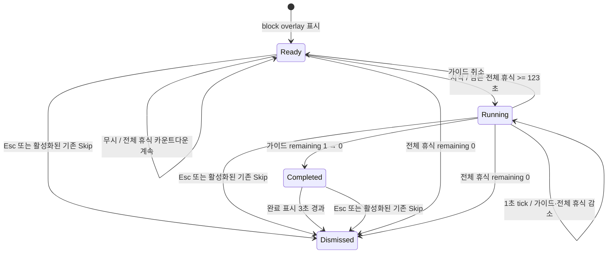

# Start One Guided Break — MVP PRD

- 문서 상태: 구현·실런타임 QA 완료, v0.12.0 릴리스 기준선
- 대상 릴리스: v0.12.0
- 근거 원장: `docs/product/utility-discovery.md`
- 수용 기준: `docs/product/utility-mvp-acceptance.md`
- 검증 상태: 자동 모델·빌드와 실제 CuaDriver Guided Break 흐름 PASS. 실제 VoiceOver 음성, 접근성 표시 설정 변형, multi-display는 환경 의존 N/A
- 표기: **사실**은 코드·문헌으로 확인, **해석**은 사실에 기반한 제품 판단, **가정/미검증**은 후속 검증 필요

## 1. 한 문장 정의

macOS 14+에서 장시간 일하는 지식노동자가 block-mode 휴식 화면을 마주했을 때, 다른 앱이나 터미널로 이동하지 않고 한 번의 `시작`으로 2분 서서 목·어깨 스트레칭을 수행하고 명시적 완료를 확인하도록 돕는다.

## 2. 문제, 사용자, 가치

### 문제

**사실:** 현재 `BreakScreenApp`은 무작위 활동 문구와 휴식 전체 카운트다운만 보여 주고, 실제 가이드는 별도 `break-reminder break ...` TUI에 있다. 휴식 시점의 추천과 수행 가능한 가이드가 서로 다른 표면에 있다(`utility-discovery.md:20-30`, `helpers/Sources/BreakScreenApp/main.swift:28-34,148-176`, `cmd/break-reminder/break.go`).

**해석:** 가장 작은 해결 대상은 알림을 추가하거나 활동을 개인화하는 것이 아니라, 이미 표시되는 네이티브 휴식 화면 안에서 한 활동의 시작과 완료를 연결하는 것이다.

### 대상 사용자

- **1차 사용자(가정 U-001):** macOS 14+에서 장시간 컴퓨터로 일하고, `break_screen_mode: block`을 사용하거나 `ask`에서 block을 선택한 지식노동자/개발자.
- **이번 MVP가 닿지 않는 사용자:** notify mode 사용자, Windows/Linux 사용자, 휴식 화면을 전혀 사용하지 않는 사용자.

### 핵심 가치 제안

한 화면, 한 기본 활동, 한 번의 시작, 명시적 완료를 제공해 실제 휴식 시작·완료의 조작 마찰을 줄인다. 생산성, 건강 치료, 장기 완료율 향상은 약속하지 않는다.

## 3. 목표와 성공 조건

### 목표

1. 기존 timer → breakscreen → Swift helper 경계에서 단일 가이드 흐름을 완결한다.
2. 사용자가 시작하지 않거나 중간 취소해도 기존 휴식 화면과 Go 타이머가 정상 동작한다.
3. 성공을 원격 분석 없이 결정적 로컬 상태 전이와 UI 결과로 판정한다.

### 성공의 대리 지표

- 기능 성공 판정 조건: `ready → running(120) → completed(3) → dismiss`가 순수 Swift 모델에서 결정적으로 재현되고, 수동 wall-clock QA에서 실제 1초 타이머의 120초 활동과 3초 완료 표시 후 종료가 관찰되어야 한다. 후자는 현재 `NOT RUN`이다.
- 조작 성공: ready 화면에서 키보드 또는 포인터 한 번으로 시작한다.
- 안전 성공: Swift는 config/state/history/log를 쓰지 않으며 Go `State`의 필드를 추가·삭제·변경하지 않는다.

### 비목표

- 생산성·건강 효과 또는 완료율 향상 증명
- 상황 맞춤, AI, 랜덤 추천, 여러 활동 선택
- 메뉴바·Dashboard·notify mode 기능 추가
- 완료 기록, 스트릭, 통계, 로컬/원격 텔레메트리
- 새 계정, 백엔드, 유료 API, macOS 권한
- SEC-001/SEC-002/TIDY-002 해결
- 버전 범프, 릴리스, 배포

## 4. 근거 추적표

| 제품 결정 | 유형 | 근거 | 영향 |
|---|---|---|---|
| 시작·완료 마찰을 1차 문제로 둔다 | 사실→해석 | 추천 문구는 `BreakScreenApp`, 실행 가이드는 별도 TUI (`utility-discovery.md:20-30`) | 기존 block overlay 안에서 수직 슬라이스 |
| 활동은 하나의 2분 목·어깨 스트레칭으로 고정한다 | 가정 U-008 | 짧은 휴식은 활력/피로에 작은 효과가 있으나 최적 활동·길이는 미검증 (`utility-discovery.md:17-19,57-62`) | 개인화/선택 UI 금지, 검증 가능한 기본값만 사용 |
| 생산성 향상을 주장하지 않는다 | 사실 | 메타분석의 전체 수행 효과가 유의하지 않음 (`utility-discovery.md:17-18,129-131`) | 카피·문서에서 생산성 약속 금지 |
| 새 상태/설정/분석을 만들지 않는다 | 사실→범위 결정 | Go가 state를 소유하고 다중 writer 위험이 있음 (`AI_CONTEXT.md:42-48`, `state.go:264-445`) | 성공은 휘발성 Swift 모델/UI로 관측 |
| block mode만 바꾼다 | 범위 가정 U-009 | `breakscreen.Show`가 block/notify/ask를 분기 (`breakscreen.go:10-41`) | notify와 메뉴바/대시보드 무변경 |
| 60초 launchd 실행 계약을 보존한다 | 사실 | 기본 check 및 LaunchAgent `StartInterval`은 60초이며, 실행 중인 동일 job의 interval firing은 missed된다(`defaults.go:27`, `launchd.go:234-256`, `overlay_darwin.go:14-44`, `launchd.plist(5)`) | Go 상태는 helper 전에 저장되고, helper 종료 뒤 다음 interval에서 Go check가 재개되며 Swift helper는 파일을 쓰지 않음 |
| macOS 14+만 지원한다 | 사실 | Swift Package 플랫폼이 `.macOS(.v14)` (`helpers/Package.swift:4-7`) | 하위 OS 호환 작업 없음 |

## 5. 단일 사용자 여정

### 진입 전제

1. 기존 Go `timer.Tick`이 임계값을 넘어 `EnterBreak`와 `ActionNotifyBreakTime`을 만든다.
2. `runCheck`는 `state.Update`로 break 상태를 먼저 저장한 뒤 action을 실행한다(`check.go:56-85`).
3. block mode에서 기존 `break-screen` helper가 남은 전체 휴식 시간, skip 시점, 당일 통계를 받는다. MVP는 이 CLI 계약을 바꾸지 않는다.

### Happy path

1. 휴식 화면이 열린다. 기존 휴식 전체 카운트다운·진행률·당일 통계·Skip·Esc는 유지된다.
2. 무작위 활동 문구 대신 고정 카드 `2분 동안 서서 목과 어깨를 풀어보세요`와 기본 동작 `시작`을 표시한다.
3. 남은 전체 휴식 시간이 123초 이상이면 `시작`이 활성화된다. 사용자가 누르면 가이드가 `running(120)`으로 전환된다.
4. 같은 화면에서 초 단위 가이드 카운트다운과 세 단계 문구를 순서대로 표시한다. 외부 앱/터미널은 열지 않는다.
5. 120번째 tick에서 `completed(3)`으로 전환하고 `완료했어요 — 편안하게 남은 휴식을 이어가세요`를 텍스트와 VoiceOver announcement로 표시한다.
6. 3초 후 overlay를 닫는다. Go의 휴식 전체 상태는 그대로 `break`이며, helper를 기다리던 `check`가 반환한 뒤 다음 launchd interval에서 기존 정책대로 갱신·종료를 재개한다. 실제 123초 wall-clock 종료는 수동 QA 전까지 `NOT RUN`이다.

### 단계 문구 계약

활동 ID와 문구는 버전이 있는 고정 로컬 콘텐츠로 둔다.

- ID: `standing-neck-shoulder-stretch-v1`
- 120–81초: `편안히 서서 어깨의 힘을 빼세요.`
- 80–41초: `고개를 천천히 좌우로 기울이고, 통증이 있으면 멈추세요.`
- 40–1초: `어깨를 뒤로 천천히 돌리며 호흡하세요.`
- 완료: `완료했어요 — 편안하게 남은 휴식을 이어가세요.`

의학적 치료·효능 표현은 쓰지 않는다.

## 6. 상태 및 상호작용 흐름

### 무시·취소·Skip 구분

- **무시:** 시작을 누르지 않는다. ready를 유지하며 기존 전체 휴식 타이머가 계속 진행된다. 자동 시작하지 않는다.
- **가이드 취소:** running의 `가이드 취소`는 ready로 돌아간다. 남은 전체 휴식 시간이 123초 이상이면 다시 시작할 수 있다. 기록이나 state write는 없다.
- **Esc:** 어느 phase에서든 overlay 전체를 즉시 닫는다. 기존 동작을 유지한다.
- **기존 Skip:** `args.skipAfter` 전에는 disabled, 이후 `Skip Break`로 활성화되어 overlay 전체를 닫는다. 가이드 기능이 이 정책을 앞당기지 않는다.
- **전체 휴식 종료:** 어느 phase에서든 전체 휴식 remaining이 0이면 즉시 닫으며 완료로 기록하지 않는다.

### 짧은 잔여 시간

- `activityDurationSeconds + completionDisplaySeconds = 123`초보다 남은 전체 휴식이 짧으면 시작을 disabled 처리하고 `이번 휴식에는 2분이 남지 않았어요.`를 표시한다.
- ready 중 123초 미만이 되면 즉시 disabled 된다.
- 이 조건은 짧은 사용자 설정과 늦은 조작에서 가이드가 휴식 전체를 연장하는 것을 막는다.

## 7. 구현 계약

### 고정 결정: 기존 Go↔Swift CLI·config·state는 변경하지 않는다

- 새 CLI flag, command, config key, Go `State` 필드, state 파일 key를 추가하지 않는다.
- 현재 `--duration`, `--skip-after`, `--work-min`, `--break-min` 계약을 그대로 사용한다.
- 고정 활동 콘텐츠와 휘발성 phase는 Swift helper에만 둔다.
- `break_activities_enabled`의 기존 의미를 이번 MVP에서 재정의하지 않는다. block overlay의 고정 카드는 block-mode 기본 경험이며 새 토글을 만들지 않는다.

### Swift 순수 모델 명명·스키마

`helpers/Sources/HelperCore/GuidedBreakSession.swift`에 다음 public 계약을 구현한다. 구현자는 다른 이름이나 중복 모델을 만들지 않는다.

- `GuidedBreakPhase: Equatable`
  - `.ready`
  - `.running(remainingSeconds: Int)`
  - `.completed(remainingDisplaySeconds: Int)`
- `GuidedBreakTickResult: Equatable`
  - `.stay`
  - `.phaseChanged`
  - `.dismiss`
- `GuidedBreakSession`
  - `static let activityID = "standing-neck-shoulder-stretch-v1"`
  - `static let activityDurationSeconds = 120`
  - `static let completionDisplaySeconds = 3`
  - `private(set) var phase: GuidedBreakPhase = .ready`
  - `mutating func start(availableBreakSeconds: Int) -> Bool`: 123초 이상일 때만 running(120), 성공 여부 반환
  - `mutating func cancel()`: running만 ready로 전환, 그 외 no-op
  - `mutating func tick() -> GuidedBreakTickResult`: running은 매 tick 1초 감소하고 120번째 tick에서 completed(3)으로 전환한다. completed(3)은 다음 tick에 2, 그다음 1이 되며 세 번째 tick에서 `.dismiss`를 반환한다. `.completed(0)`은 외부에 노출하지 않는다.
  - `func instructionText() -> String`: 위 단계 문구 계약에 따른 결정적 문구

`BreakScreenApp`은 기존 1초 timer가 먼저 전체 휴식 remaining을 감소시킨 뒤 session을 tick한다. 전체 휴식 remaining이 0이면 session 결과보다 overlay 종료가 우선이다.

### 예상 수정 지점

| 지점 | 책임 | 테스트 지점 |
|---|---|---|
| `helpers/Sources/HelperCore/GuidedBreakSession.swift` (신규) | phase, 시작 가능 조건, 120초 진행, 3초 완료, 문구 | `helpers/Tests/HelperCoreTests/GuidedBreakSessionTests.swift` |
| `helpers/Sources/BreakScreenApp/main.swift` | 고정 카드/버튼/레이블 렌더, 기존 timer와 session 연결, VoiceOver·키보드 | 빌드 + 수동 QA |
| 기존 Go 코드 | 변경 없음이 기본. 회귀만 확인 | `internal/timer`, `internal/state`, `internal/breakscreen`, `cmd/break-reminder` 기존 테스트 |

## 8. 오류·복구 정책

- helper 미발견: 기존대로 warning 후 notification fallback. 새 오류 UI/재시도 루프를 만들지 않는다(`overlay_darwin.go:17-21`).
- helper 비정상 종료: 기존대로 warning을 남기며 Go state는 이미 break로 저장되어 있다. blocking `check`가 반환한 뒤 다음 launchd interval의 check가 복구한다(`overlay_darwin.go:40-44`, `check.go:56-85`).
- 잘못되거나 누락된 CLI 숫자: 기존 `BreakScreenArgs` 기본값을 유지한다. MVP가 parser 계약을 넓히지 않는다.
- UI 재시작/재실행: guided phase는 복원하지 않고 ready에서 시작한다. 전체 휴식 남은 시간만 기존 `breakStart` 계산을 따른다. 완료로 추정하거나 자동 시작하지 않는다.
- 다중 모니터: 기존처럼 primary에만 상호작용 UI, secondary에는 비상호작용 휴식 표면을 유지한다.

## 9. 접근성·프라이버시·호환성

### 접근성

- `시작`을 primary/default action으로 하고 Space/Return으로 실행 가능해야 한다.
- focus 순서: `시작` 또는 `가이드 취소` → 활성화된 기존 `Skip Break`. 비활성 Skip은 focus 대상에서 제외한다.
- 레이블:
  - 시작: label `2분 목과 어깨 스트레칭 시작`, hint `같은 화면에서 2분 가이드를 시작합니다.`
  - 취소: label `가이드 취소`, hint `가이드를 멈추고 휴식 화면으로 돌아갑니다.`
  - 진행: label `목과 어깨 스트레칭`, value `남은 시간 N분 N초, <현재 단계>`
  - 완료: announcement `2분 스트레칭을 완료했습니다.`
- 색·진행 막대만으로 phase를 전달하지 않고 title, 남은 시간, 단계 텍스트를 함께 쓴다.
- Reduce Motion이 켜져 있어도 상태 전이를 애니메이션에 의존하지 않는다. 이번 MVP는 새 필수 애니메이션을 추가하지 않는다.

### 프라이버시와 사용자 자산

- 네트워크 요청, 새 로그 이벤트, 분석, 계정, 식별자 수집 없음.
- `~/.config/break-reminder/config.yaml`, `~/.break-reminder-state`, history, 로그를 Swift가 읽거나 쓰지 않는다.
- 루트 PNG, 기존 hamster/vector asset, `.analysis/**`, `.serena/**`를 사용·변형·이동·삭제·스테이징하지 않는다.

### 호환성

- macOS 14+, 기존 AppKit/Swift 5.9/SPM만 사용하며 새 dependency 없음.
- Go timer/state/config와 CLI 인자 하위 호환 유지.
- notify/ask의 notify 선택, 메뉴바, Dashboard, TUI 활동은 동작과 카피 모두 무변경.

## 10. 범위 우선순위

### Must

- block overlay의 고정 활동 카드와 ready/running/completed 상태
- 123초 start guard, 120초 카운트다운, 3초 완료 표시 후 dismiss
- 무시, 가이드 취소, Esc, 기존 Skip, 전체 휴식 종료 동작
- 순수 HelperCore 모델과 자동 테스트
- 키보드·VoiceOver 의미, 색 이외 상태 표현
- Go state/config/CLI 무변경 및 전체 Go/Swift 회귀

### Should

- 수동 120초 실제 런타임 QA와 VoiceOver announcement 확인
- primary/secondary display 회귀 확인

### Could

- 없음. 이번 사이클에서 편의 기능을 추가하지 않는다.

### Out

비목표에 적힌 개인화·복수 활동·새 표면·기록·텔레메트리·백엔드·릴리스 전체.

## 11. 30분 구현 카드 경계

이 MVP는 하나의 구현 카드로 수행한다. 시간은 구현 순서의 상한 가이드이며 수동 접근성·123초 실런타임과 전체 회귀는 구현 후 검증 시간으로 별도 수행한다.

1. 0–5분: `GuidedBreakSessionTests`에 122/123 start guard, 60/120/123 tick, cancel/restart RED 작성·실패 확인.
2. 5–15분: `GuidedBreakSession.swift` 최소 구현으로 unit GREEN.
3. 15–25분: 기존 `BreakScreenApp`의 무작위 activity 영역만 고정 카드·Start/Cancel·phase 렌더로 교체하고 기존 전체 timer/Esc/Skip을 연결.
4. 25–30분: target Swift tests/build, 관련 Go 회귀, diff contract 검사. 실패 시 범위를 늘리지 않고 동일 카드 안에서 제한적으로 재작업한다.

## 12. 롤백

1. 신규 `GuidedBreakSession.swift`와 테스트를 제거한다.
2. `BreakScreenApp/main.swift`의 가이드 카드/session 연결만 기존 무작위 activity label 렌더로 되돌린다.
3. Go/config/state/CLI가 바뀌지 않으므로 migration이나 사용자 데이터 복구가 없다.
4. 롤백 전후 `make test`, `make build`로 기존 기준선을 확인한다.

## 13. 미검증 후속 질문

- block-mode 사용자 비율과 실제 start/cancel/완료 비율은 알 수 없다. 원격 텔레메트리 없이 사용자 관찰/인터뷰로 별도 검증한다.
- 2분 목·어깨 스트레칭이 눈 휴식·호흡보다 적합한지 검증되지 않았다.
- 고정 활동 반복이 장기적으로 무시를 늘리는지 검증되지 않았다.
- launchd `StartInterval`은 동일 job이 실행 중인 firing을 누락하며 catch-up하지 않는다. 따라서 overlay 중 동시 Go tick을 기대하지 않는다. helper 종료 뒤 다음 interval 재개와 장시간 gap의 통계 정확성은 수동 실런타임 QA 전까지 미검증이다.
